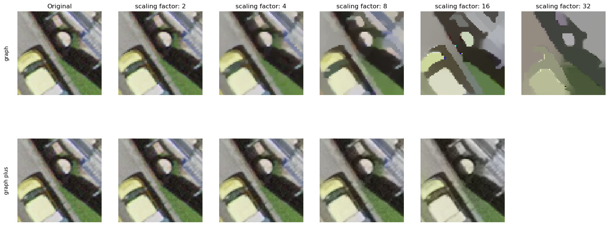

# Prospects of graph regularized super resolution in pan-sharpening

This is the official implementation of the Bachelor thesis: 

### "Prospects of graph regularized super resolution in pan-sharpening" (IGP 2024)

Mathis Erler, supervised by ALexander Becker, Konrad Schindler

The full thesis can be found [here](Bachelorarbeit.pdf).

As the whole thesis, also this code implementation is based on the original code of the paper "Learning Graph Regularisation for Guided Super-Resolution" by Riccardo de Lutio, Alexander Becker, Stefano D'Aronco, Stefania Russo, Jan D. Wegner, Konrad Schindler.
**[[Paper]](https://arxiv.org/abs/2203.14297) &nbsp;|&nbsp; [[5 minute explainer video]](https://www.youtube.com/watch?v=ZFDErHUlCBE&ab_channel=RiccardodeLutio)**




## Abstract

We introduce a novel formulation for guided super-resolution. Its core is a differentiable optimisation layer that operates on a learned affinity graph. The learned graph potentials make it possible to leverage rich contextual information from the guide image, while the explicit graph optimisation within the architecture guarantees rigorous fidelity of the high-resolution target to the low-resolution source. 
With the decision to employ the source as a constraint rather than only as an input to the prediction, our method differs from state-of-the-art deep architectures for guided super-resolution, which produce targets that, when downsampled, will only approximately reproduce the source. This is not only theoretically appealing, but also produces crisper, more natural-looking images.
A key property of our method is that, although the graph connectivity is restricted to the pixel lattice, the associated edge potentials are learned with a deep feature extractor and can encode rich context information over large receptive fields. By taking advantage of the sparse graph connectivity, it becomes possible to propagate gradients through the optimisation layer and learn the edge potentials from data.
We extensively evaluate our method on several datasets, and consistently outperform recent baselines in terms of quantitative reconstruction errors, while also delivering visually sharper outputs. Moreover, we demonstrate that our method generalises particularly well to new datasets not seen during training.

## Setup

### Dependencies
We recommend creating a new conda environment with all required dependencies by running
```bash
conda env create -f environment_pan.yml
conda activate graph-sr-pan
```

### Data
All models were trained on syntetic data. As a datasource we used Swissimage 10cm. Acces on the images was March 2024. To replicate the results, townload all image links from[[Swissimage 10cm]](https://www.swisstopo.admin.ch/de/orthobilder-swissimage-10-cm) and place them in a folder. The script downloader.py in the folder pan_additions can be used to make the data split and download the images. The script preprocessor.py can be used to cut the large imaeg patches into smaller parts and save them in npy arrays for fast acces during training.
```

### Checkpoints
Our pretrained model checkpoints which were used for the numbers in the tesis can be found [[here]](https://drive.google.com/drive/folders/1Via3dit1A-7rEyZ0U4E3qqbW5dXjDovj?usp=sharing). 

## Training

Run the training script via
```bash
python run_train.py --dataset <...> --data-dir <...> --save-dir <...>
```
Hyperparameter defaults are set to the values from the paper. Depending on the dataset, you have to adjust the number of epochs (`--num-epochs`) and the scheduler step size (`--lr-step`), see appendix A of the paper. You can see all available training options by running 
```bash
python run_train.py -h
```

## Evaluation

For test set evaluation, run

```bash
python run_eval.py --checkpoint <...> --dataset <...> --data-dir <...>
```
Again, you can query all available options by running 
```bash
python run_train.py -h
```
The folder bash scripts offers scripts to train and evaluate models in parallel on a SLURM cluster.

## Acknowledgements
We thank the authors of the original paper for providing their code and support, as well as the authors of the datasets used in this work. 

## License
This code is released under the MIT License (refer to the LICENSE file for details).

## Contact
If you have any questions, feel free to reach out to Mathis Erler (merler@ethz.ch)
